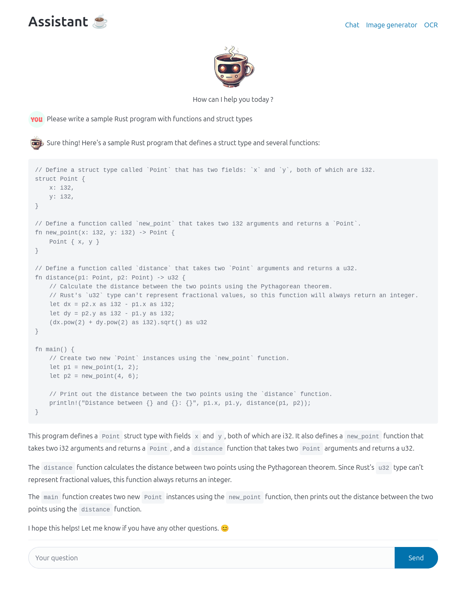
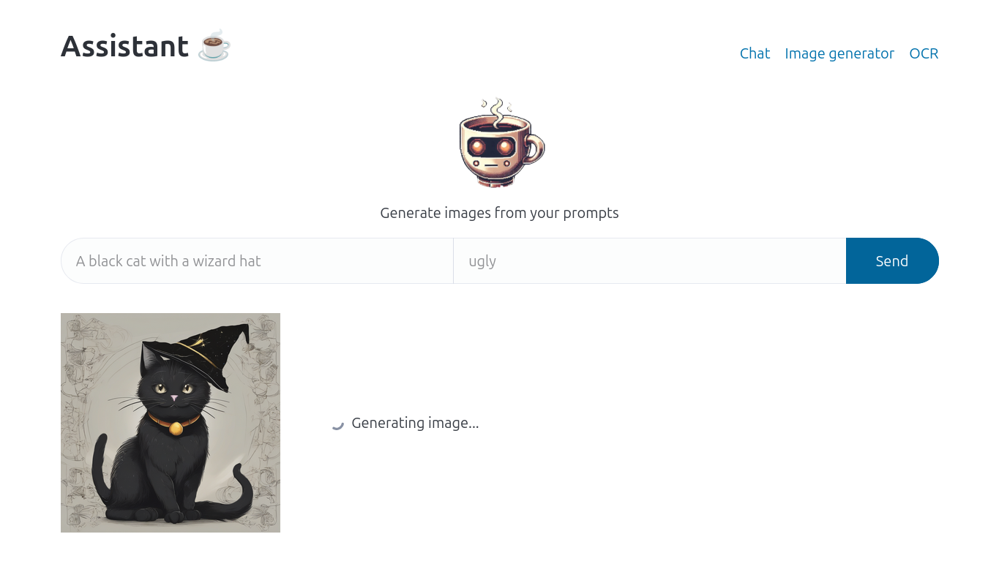

# Quarkus OVH AI endpoints

Experiments of OVH AI endpoints with quarkus and langchain4j

## Run project

Go to https://endpoints.ai.cloud.ovh.net/ and create an API token.

Create `OVH_API_TOKEN` variable with your token value.

```shell
export OVH_API_TOKEN=<your token>
```

Then run quarkus app with

```shell
quarkus dev
```

## Endpoints

### LLM (Mixtral-8x22B-Instruct)

Endpoint : http://localhost:8080/ai-assistant/ask

Body :

```text
'{"question": "Please write a Rust sample program"}'"}'
```

Response example :

```text
🛠️ Hello there! I'm here to assist you with your programming needs! To write a simple Rust program, you can use the following code:

\```rust
// Greetings in Rust 🦀
fn main() {
    println!("🌍 Hello, World!");
}
\```

To run this code, you will need to have Rust and its package manager, `cargo`, installed on your machine. You can follow
the installation instructions on the Rust website: https://www.rust-lang.org/tools/install

To create a new project and run the code, follow these steps:

1. Open a terminal and navigate to the directory where you want to create your project.
2. Run the command `cargo new my_project` to create a new project called "my_project". This will create a new folder
   with the same name.
3. Navigate to the new project folder by running `cd my_project`.
4. Replace the contents of the `src/main.rs` file with the code above.
5. Run the program by typing `cargo run` in the terminal.

You should see the message "🌍 Hello, World!" printed to the console.

Happy coding! 🤓

```

### Image generation (stable-diffusion-xl)

Endpoint : http://localhost:8080/ai-assistant/generate-image

Body :

```json
{
  "prompt": "A black cat with a wizard hat",
  "negative_prompt": "uggly"
}
```

Response example :


### Image reading / OCR (llava-next-mistral-7b)

Endpoint : http://localhost:8080/ai-assistant/ocr

Body :

Multipart query with image file that contains text to read.

```text
body:multipart-form {
  file: @file(file path)
}
```

## UI

The features are also accessible via a UI at http://localhost:8080.

I used the [Qute](https://quarkus.io/guides/qute) templating engine for server-side rendering of HTML pages. The APIs
are called using vanilla JS with fetch.

Here’s what it looks like:

Chatbot :



Image generator :



OCR (with OVH playground image example) :


## Build docker image

```shell
docker build -f src/main/docker/Dockerfile.native-micro -t ziggornif/ovh-ai-endpoints .
```

## Sources

- https://blog.ovhcloud.com/how-to-use-ai-endpoints-and-langchain4j/
- https://blog.ovhcloud.com/llms-streaming-with-ai-endpoints-and-langchain4j/